# Dependency Map & External Integrations

## 1. Gradle Project Module Dependency Graph

The Android application is structured as a multi-module project across 16 subprojects declared in [settings.gradle.kts](file:///d:/Projects2026/dsaapp/settings.gradle.kts).

```mermaid
graph TD
    app[":app"] --> core_designsystem[":core:designsystem"]
    app --> core_navigation[":core:navigation"]
    app --> core_common[":core:common"]
    app --> core_database[":core:database"]
    app --> core_datastore[":core:datastore"]
    app --> core_notifications[":core:notifications"]
    app --> core_calendar[":core:calendar"]
    app --> core_network[":core:network"]
    app --> domain_model[":domain:model"]
    app --> domain_repository[":domain:repository"]
    app --> domain_usecase[":domain:usecase"]
    app --> data_repository[":data:repository"]
    app --> feature_onboarding[":feature:onboarding"]
    app --> feature_home[":feature:home"]
    app --> feature_contests[":feature:contests"]
    app --> feature_contestdetail[":feature:contestdetail"]
    app --> feature_platforms[":feature:platforms"]
    app --> feature_platformdetail[":feature:platformdetail"]
    app --> feature_resources[":feature:resources"]
    app --> feature_settings[":feature:settings"]
    app --> sync[":sync"]

    feature_home --> data_repository
    feature_contests --> data_repository
    feature_platformdetail --> data_repository
    feature_platforms --> data_repository
    feature_resources --> core_network
    feature_settings --> data_repository

    data_repository --> core_database
    data_repository --> core_network
    data_repository --> domain_model

    core_database --> domain_model
    core_network --> domain_model
```

### Module Utilization & Status Audit

| Gradle Module | Status | Actual Content / Purpose | Architectural Anomaly |
|---|---|---|---|
| `:app` | Active | Application entry, `MainActivity`, navigation host, theme provider. | Contains `CloudAdminSyncService.kt` and ProGuard configuration. |
| `:core:common` | Active | `NetworkMonitor`, UI events, state primitives. | Functioning as intended. |
| `:core:designsystem`| Active | Glassmorphic design tokens, typography, shaders, custom buttons. | Functioning as intended. |
| `:core:database` | Active | Room DB `MyCodeCalendarDatabase`, 9 Entities, 6 DAOs. | Contains type converters for `Instant`. `exportSchema = false`. |
| `:core:network` | Active | `RemoteDataSource`, `NetworkModels`, Ktor client engine. | Configured with ghost base URL `https://api.mycodecalendar.com/v1`. |
| `:core:datastore` | Active | `SettingsPreferences` DataStore implementation. | Mostly bypassed in favor of `SharedPreferences`. |
| `:core:notifications`| Active | `NotificationHelper`, `ReminderScheduler`, `ReminderReceiver`. | Lacks `BOOT_COMPLETED` receiver and FCM receiver. |
| `:core:calendar` | Active | `CalendarContractManager` for system calendar export. | Missing `READ_CALENDAR` / `WRITE_CALENDAR` manifest permissions. |
| `:core:analytics` | **STUB** | Empty directory containing only `build.gradle.kts`. | No code, no analytics tracking implemented. |
| `:domain:model` | Active | Pure Kotlin data classes: `Contest`, `PlatformStats`, `StreakInfo`.| Clean and decoupled. |
| `:domain:repository`| **STUB** | Contains two interface definitions ([RepositoryInterfaces.kt](file:///d:/Projects2026/dsaapp/domain/repository/src/main/java/com/mycodecalendar/domain/repository/RepositoryInterfaces.kt)). | Never implemented by the data layer. |
| `:domain:usecase` | **PARTIAL**| Contains `GetRecommendedResourceUseCase.kt` and unit test. | Unused by UI layer; ViewModels call `FakeRepository` directly. |
| `:data:repository` | Active | Contains monolithic `FakeRepository.kt` (1980 LOC) and `ContestRepositoryImpl.kt`. | Contains all app logic, caching, mapping, and network orchestration. |
| `:data:local` | **STUB** | Empty directory containing only `build.gradle.kts`. | Dead module. |
| `:data:remote` | **STUB** | Empty directory containing only `build.gradle.kts`. | Dead module. |
| `:data:mapper` | **STUB** | Empty directory containing only `build.gradle.kts`. | Dead module. Mappers placed in `:data:repository`. |
| `:sync` | **STUB** | `ContestSyncWorker` with a `println()` body. | Never scheduled by any component. |
| `:widget` | **STUB** | Empty directory containing only `build.gradle.kts`. | Dead module. |
| `:backend` | **DISCONNECTED**| Contains compiled build outputs in `backend/build/`. | Excluded from `settings.gradle.kts`, but referenced in `.github/workflows/pr.yml`. |

---

## 2. Third-Party Android SDKs & Libraries

Extracted from [gradle/libs.versions.toml](file:///d:/Projects2026/dsaapp/gradle/libs.versions.toml):

| Library Name | Version | Purpose in CodeCalendar | Security & Performance Considerations |
|---|---|---|---|
| **Ktor Client** | `2.3.8` | HTTP networking engine with Android engine and ContentNegotiation JSON serializer. | `requestTimeoutMillis = 12_000L`. No connection pool tuning. |
| **Kotlinx Serialization** | `1.6.2` | JSON parsing for API responses and Room entity JSON blobs. | Efficient reflective-free serialization. |
| **Room Database** | `2.6.1` | SQLite local database with KSP code generator. | `fallbackToDestructiveMigration()` enabled. `exportSchema = false`. |
| **Firebase BOM** | `33.7.0` | Firebase bill-of-materials managing Auth, Firestore, and Play Services. | Direct client-side calls to Firestore without repository boundary. |
| **Play Services Auth** | `21.2.0` | Google Sign-In SDK for account chooser. | Configured without server client ID, resulting in anonymous fallback. |
| **Jetpack Compose BOM** | `2024.02.00` | UI toolkit with Material 3. | Standard Compose foundation. |
| **Coil Compose** | `2.6.0` | Asynchronous image loader for avatars and contest logos. | Well-suited for Compose image loading. |
| **WorkManager** | `2.9.0` | Android background job scheduler. | Configured in dependencies, but only utilized by inactive dummy worker. |

---

## 3. Web Admin Portal Dependencies (`codecalendar-admin`)

Extracted from [codecalendar-admin/package.json](file:///d:/Projects2026/dsaapp/codecalendar-admin/package.json):

| Package | Version | Purpose | Risk / Notes |
|---|---|---|---|
| `react` / `react-dom` | `^19.2.8` | Frontend rendering framework. | Recent React 19 release. |
| `firebase` | `^12.17.1` | Web SDK for Firestore, Auth, and Storage. | Full modular web bundle imported directly. |
| `lucide-react` | `^1.31.0` | Iconography. | Clean SVG icons. |
| `framer-motion` | `^13.1.0` | Glassmorphic and drawer micro-animations. | High bundle footprint. |
| `browser-image-compression` | `^2.0.2` | Client-side compression for CMS image uploads. | Used in `ImageUploader.tsx`. |
| `tailwindcss` | `^3.4.19` | Utility CSS framework. | Standard Tailwind configuration. |

---

## 4. Upstream Network APIs & External Services

| Target Domain | Protocol / Format | Authentication | In-Code Reference | Upstream Risk |
|---|---|---|---|---|
| `leetcode.com` | POST GraphQL | None (Public) | [RemoteDataSource.kt:L74](file:///d:/Projects2026/dsaapp/core/network/src/main/java/com/mycodecalendar/core/network/RemoteDataSource.kt#L74) | Undocumented public schema. Could change query syntax without notice. |
| `codeforces.com` | GET JSON | None (Public) | [RemoteDataSource.kt:L112](file:///d:/Projects2026/dsaapp/core/network/src/main/java/com/mycodecalendar/core/network/RemoteDataSource.kt#L112) | Rate-limited at 5 requests/sec per IP. Frequent Cloudflare DDOS protection screens. |
| `codechef.com` | GET JSON / HTML | None | [RemoteDataSource.kt:L61](file:///d:/Projects2026/dsaapp/core/network/src/main/java/com/mycodecalendar/core/network/RemoteDataSource.kt#L61) | HTML profile scraping breaks whenever CSS classes change. |
| `atcoder.jp` / `kenkoooo.com` | GET JSON | None | [RemoteDataSource.kt:L97](file:///d:/Projects2026/dsaapp/core/network/src/main/java/com/mycodecalendar/core/network/RemoteDataSource.kt#L97) | Community Kenkoooo API could be throttled or deprecated. |
| `api.github.com` | GET JSON | None | [RemoteDataSource.kt:L242](file:///d:/Projects2026/dsaapp/core/network/src/main/java/com/mycodecalendar/core/network/RemoteDataSource.kt#L242) | Strict 60 req/hr rate limit per IP for unauthenticated queries. |
| `github-contributions-api.jogruber.de` | GET JSON | None | [RemoteDataSource.kt:L277](file:///d:/Projects2026/dsaapp/core/network/src/main/java/com/mycodecalendar/core/network/RemoteDataSource.kt#L277) | Third-party community proxy with unknown uptime SLA. |
| `geeksforgeeks.org` | GET HTML | None | [RemoteDataSource.kt:L365](file:///d:/Projects2026/dsaapp/core/network/src/main/java/com/mycodecalendar/core/network/RemoteDataSource.kt#L365) | HTML scraping fragile to DOM updates. |
| `firestore.googleapis.com` | gRPC / HTTPS | Firebase Auth | `CloudAdminSyncService.kt` | Security rules restrict access. High billing risk on unbounded queries. |
| `kontests.net` | Defunct | Bypassed | [RemoteDataSource.kt:L50](file:///d:/Projects2026/dsaapp/core/network/src/main/java/com/mycodecalendar/core/network/RemoteDataSource.kt#L50) | Formerly used service; now returns hardcoded `emptyList()`. |
