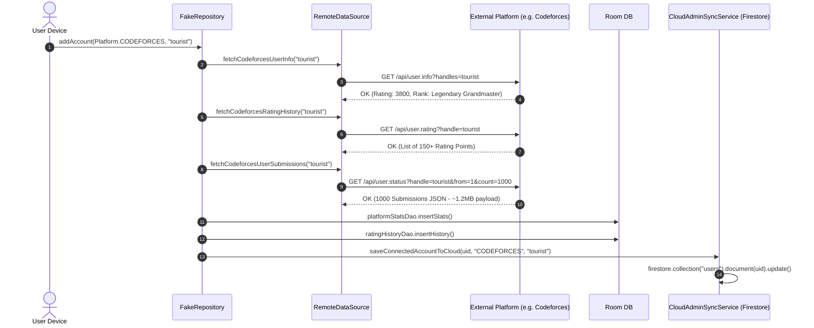

# Request Flow & Data Lifecycle

## 1. Flow 1: Live Contest Radar Refresh

This sequence traces the fetching and caching of live/upcoming competitive programming contests across LeetCode, Codeforces, CodeChef, and AtCoder.

```mermaid
sequenceDiagram
    autonumber
    actor User as Mobile User / Polling Loop
    participant VM as HomeViewModel
    participant Repo as FakeRepository
    participant RDS as RemoteDataSource
    participant LC as LeetCode GraphQL
    participant CF as Codeforces API
    participant CC as CodeChef API
    participant AC as AtCoder (Kenkoooo)
    participant Room as Room SQLite DB
    participant UI as Compose UI StateFlow

    User->>VM: App Launch / Pull-to-Refresh / 5-min Poll
    VM->>Repo: refreshAndAwait(force)
    Repo->>Repo: Check throttle (minRefreshIntervalMs = 30s)
    
    rect rgb(30, 30, 45)
        Note over Repo,AC: Sequential Network Waterfall (Executed on Dispatchers.IO)
        Repo->>RDS: fetchLeetCodeContests()
        RDS->>LC: POST https://leetcode.com/graphql
        LC-->>RDS: JSON (All Contests)
        RDS-->>Repo: Result<List<LeetCodeContestDto>>

        Repo->>RDS: fetchCodeforcesContests()
        RDS->>CF: GET https://codeforces.com/api/contest.list
        CF-->>RDS: JSON (Codeforces Contests)
        RDS-->>Repo: Result<List<CodeforcesContestDto>>

        Repo->>RDS: fetchCodeChefContests()
        RDS->>CC: GET https://www.codechef.com/api/list/contests/all
        CC-->>RDS: JSON (CodeChef Contests)
        RDS-->>Repo: Result<List<CodeChefOfficialContestDto>>

        Repo->>RDS: fetchAtCoderContests()
        RDS->>AC: GET https://kenkoooo.com/atcoder/resources/contests.json
        AC-->>RDS: JSON (AtCoder Contests)
        RDS-->>Repo: Result<List<AtCoderContestItemDto>>
    end

    Repo->>Repo: Merge & filter active/upcoming contests (take top 10 per platform)
    Repo->>Room: contestDao.insertContests(entities)
    Repo->>Repo: contestsFlow.value = mergedContests
    Repo-->>VM: Update state
    VM-->>UI: uiState emits new HomeUiState (re-renders contest cards)
```

### Critical Bottleneck Analysis: Flow 1
* **Latency**: Each upstream request is awaited in sequence. If Codeforces or CodeChef experiences high latency (e.g. 2,500ms), the total contest sync step blocks for 4,000ms–7,000ms.
* **Failure Modes**: If one upstream API fails or times out (12s Ktor timeout), it is caught via `runCatching`, but the delay still slows the entire refresh cycle.
* **Redundant Traffic**: Every single Android device performs this identical 4-provider query independently every 5 minutes in foreground, resulting in duplicate queries that could easily be cached globally at the edge.

---

## 2. Flow 2: Platform Handle Sync & Rating History

This sequence occurs when a user links a competitive programming handle (e.g., Codeforces or GitHub) or refreshes their profile.

### Critical Bottleneck Analysis: Flow 2
* **Payload Bloat**: Fetching 1,000 raw submissions from Codeforces (`count=1000`) solely to calculate accepted problem count wastes up to 1.5 MB of cellular data on every profile refresh.
* **GitHub Rate Limit**: For GitHub handles, the app fetches user details, 100 repositories, and daily contributions without an API token, consuming 3 calls against the 60 calls/hour per-IP limit.

---

## 3. Flow 3: Authentication & Profile Cloud Sync (Bug Sequence)

This sequence traces the sign-in flow and highlights the **P0 Data Loss Bug** discovered in [MainActivity.kt](file:///d:/Projects2026/dsaapp/app/src/main/java/com/vishal/mycodecalendar/MainActivity.kt#L439-L475).

```mermaid
sequenceDiagram
    autonumber
    actor User as User
    participant Auth as AuthScreen (Compose)
    participant FBAuth as FirebaseAuth
    participant Main as MainActivity
    participant Repo as FakeRepository
    participant Cloud as CloudAdminSyncService
    participant FS as Cloud Firestore (/users)

    User->>Auth: Click "Continue with Google"
    Auth->>FBAuth: signInAnonymously() (NOT Google credential!)
    FBAuth-->>Auth: FirebaseUser (New Anonymous UID)
    Auth->>Main: onAuthSuccess(user, "Google", email, photo)
    
    rect rgb(45, 20, 20)
        Note over Main,Repo: P0 DATA LOSS SEQUENCE
        Main->>Repo: clearAllUserData()
        Repo->>Repo: connectedPlatforms.value = emptyList()
        Repo->>Repo: Wipe local SharedPreferences & Room DB
        
        Main->>Cloud: syncUserProfileToCloud(uid, connectedPlatforms = emptyList())
        Cloud->>FS: set(userData, SetOptions.merge())
        Note over FS: OVERWRITES cloud document with EMPTY platforms list!
    end

    Main->>Cloud: fetchUserStreakFromCloud(uid)
    Main->>Cloud: fetchConnectedAccountsFromCloud(uid)
    Cloud-->>Main: Returns empty list (already wiped!)
```

### Impact
* An existing user logging into their account on a new device or re-authenticating has their cloud-stored platform connections wiped out immediately because `clearAllUserData()` executes before cloud reconciliation.

---

## 4. Flow 4: Web Admin Content Publication & Client Ingestion

This sequence traces how CMS items created in the Vite React Admin portal reach Android clients.

```mermaid
sequenceDiagram
    autonumber
    actor Admin as Super Admin
    participant Portal as React Admin CMS (Vite)
    participant FS as Google Cloud Firestore
    participant Client as Android Client
    participant UI as HomeScreen / ResourcesScreen

    Admin->>Portal: Create Broadcast / Featured Sheet
    Portal->>Portal: Client-side check against ADMIN_WHITELIST
    Portal->>FS: setDoc(collection("broadcasts")) / ("featured_materials")
    Note over FS: Evaluated against firestore.rules (isAdmin check)
    FS-->>Portal: Write confirmed

    rect rgb(20, 35, 45)
        Note over Client,FS: Ingestion Paths on Mobile
        alt Home Broadcast Banner
            Client->>FS: CloudAdminSyncService.fetchCurrentBroadcast() (get query)
            FS-->>Client: CloudBroadcast (limit 1)
            Client->>UI: Render CloudBroadcastBanner
        else Featured Materials (ResourcesScreen)
            Client->>FS: LaunchedEffect: collection("featured_materials").get()
            FS-->>Client: QuerySnapshot (all documents)
            Client->>UI: Render Featured Sheets
        end
    end
```

### Architectural Flaw in Flow 4
* Direct Firestore coupling: The Android client bypasses its own repository and database abstractions, directly issuing Firebase Firestore SDK queries inside UI Composables (`LaunchedEffect` in [ResourcesScreen.kt](file:///d:/Projects2026/dsaapp/feature/resources/src/main/java/com/mycodecalendar/feature/resources/ResourcesScreen.kt#L73)). If Firebase is uninitialized or network fails, the screen does not show cached offline data for materials.
