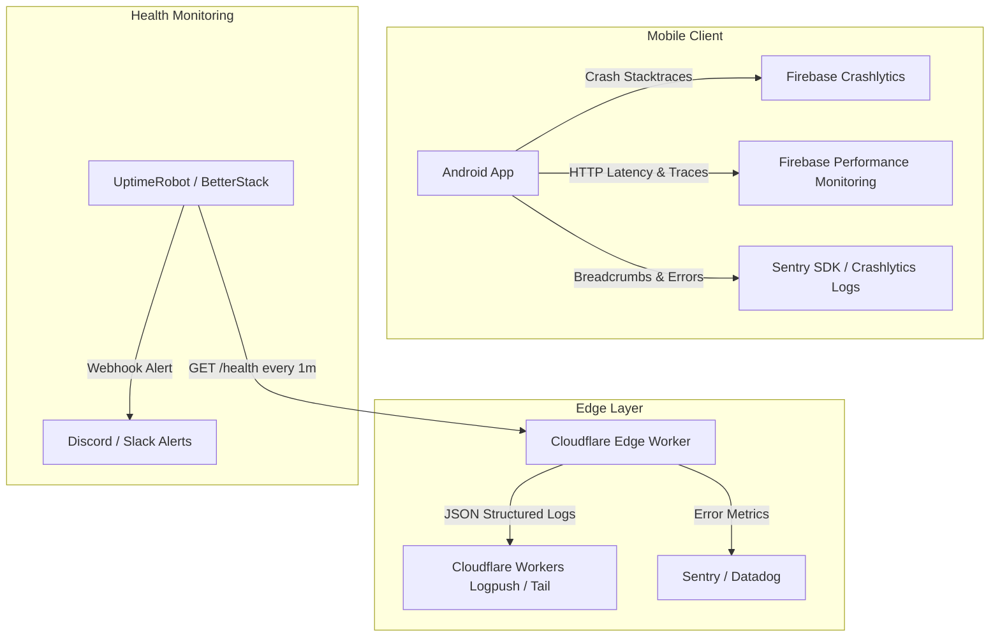

# Observability & Diagnostics Audit

## 1. The Critical Production Question

> ### "If the application becomes slow or starts returning errors at 2 AM, can the engineering team determine WHY?"
>
> ### 🛑 ANSWER: NO.
>
> In its current configuration, the engineering team has **zero production visibility** into mobile client failures, silent exceptions, network timeouts, or performance degradation. If an upstream API changes or the app crashes across 10,000 devices, no telemetry or alerts will reach the developers.

---

## 2. Observability Gap Inventory

| Telemetry Pillar | Current Implementation | Production Limitation | Risk Level |
|---|---|---|---|
| **Crash Reporting** | None. `firebase-crashlytics` is **not included** in dependencies. | If an unhandled exception occurs (e.g. `SecurityException` on Calendar export, or `IllegalStateException` on Firebase), the app crashes silently to the Android desktop. The engineering team has no record of the stack trace or device model. | **Critical** |
| **Client Logging** | `android.util.Log` and `println()` statements. | Logs are written exclusively to the local device's ephemeral Android Logcat buffer. Once the user disconnects from a development machine, logs are discarded. | **High** |
| **Performance Monitoring** | None. | No telemetry measuring screen rendering speed, startup cold-start duration, or Ktor HTTP request latencies. | **Medium** |
| **Correlation & Request IDs** | None. | Outbound requests to LeetCode, Codeforces, and Firebase do not attach correlation headers (`X-Request-ID`). Impossible to trace failed requests across client and server. | **High** |
| **Edge & Server Logging** | Absent (no Cloudflare Worker deployed for CodeCalendar). | The ghost domain `api.mycodecalendar.com` produces no logs because it has no backing server. | **Critical** |
| **Admin Portal Logging** | Browser `console.error()` / `console.warn()`. | Only visible in the individual administrator's local browser Developer Tools console. | **Medium** |
| **Uptime Monitoring & Alerting** | None. | No automated synthetics or health checks monitor the availability of LeetCode GraphQL, Codeforces API, or Firebase services. | **High** |

---

## 3. Required Observability Architecture for Production

To make the system observable and maintainable in production:

### Actionable Implementation Requirements:
1. **Add Firebase Crashlytics**:
   * Add `alias(libs.plugins.firebase.crashlytics)` to [app/build.gradle.kts](file:///d:/Projects2026/dsaapp/app/build.gradle.kts).
   * Initialize Crashlytics to automatically report uncaught JVM exceptions and coroutine failure stack traces.
2. **Implement Cloudflare Worker Structured Logging**:
   * Every request through the edge worker should log structured JSON: `timestamp`, `path`, `client_country`, `cache_status`, `upstream_status`, and `latency_ms`.
3. **Set Up Automated Synthetic Probes**:
   * Deploy an uptime monitor targeting the Cloudflare Worker `/health` endpoint to alert the team within 60 seconds if upstream contest platforms fail.
